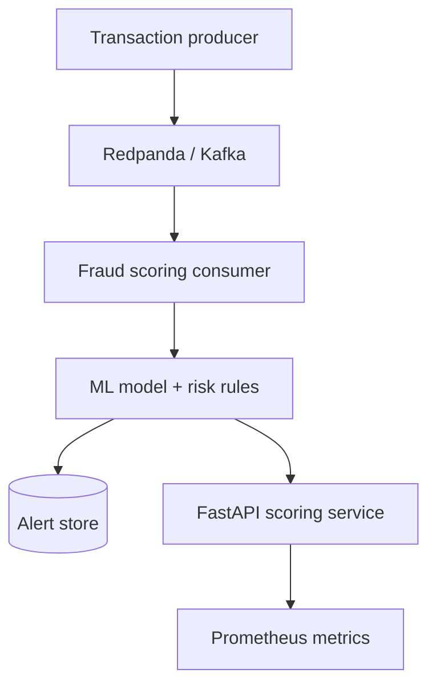

# Real-Time Fraud Detection Platform

A production-style streaming and machine-learning portfolio project that scores financial transactions in real time, records alerts, exposes operational metrics, and runs locally with Docker.

## Business outcome

Payment teams need to identify suspicious activity in seconds without blocking every legitimate customer. This platform combines machine-learning probability with explainable risk rules, returning a decision and human-readable reasons for every transaction.

## Architecture



## Features

- Kafka-compatible streaming with Redpanda
- FastAPI REST endpoint for synchronous scoring
- Reproducible scikit-learn model training
- Hybrid ML and explainable-rule decisions
- SQLite alert and decision audit trail
- Prometheus latency, volume, and fraud metrics
- Docker Compose for local infrastructure
- Automated tests and GitHub Actions
- AWS and Azure production deployment mappings

## Quick start

```bash
python -m venv .venv
source .venv/bin/activate  # Windows: .venv\\Scripts\\activate
pip install -r requirements.txt
python -m app.train
uvicorn app.api:app --reload
```

Open <http://localhost:8000/docs> and submit:

```json
{
  "transaction_id": "TX-DEMO-001",
  "amount": 9500,
  "hour": 2,
  "country": "US",
  "customer_country": "NG",
  "merchant_risk": 0.92,
  "velocity_1h": 8,
  "account_age_days": 4
}
```

## Run the streaming demonstration

```bash
docker compose up --build
```

The producer generates transactions, publishes them to `transactions`, and the consumer scores and stores every decision. View API documentation on port 8000 and Prometheus on port 9090.

## API

| Endpoint | Purpose |
|---|---|
| `GET /health` | Readiness check |
| `POST /score` | Score one transaction |
| `GET /alerts` | Retrieve recent high-risk decisions |
| `GET /metrics` | Prometheus metrics |

## Decision policy

- `APPROVE`: risk score below 0.55
- `REVIEW`: risk score from 0.55 to below 0.80
- `BLOCK`: risk score 0.80 or higher

## Cloud deployment mapping

| Layer | AWS | Microsoft Azure |
|---|---|---|
| Event streaming | Amazon MSK / Kinesis | Event Hubs |
| Scoring service | ECS/Fargate or Lambda | Container Apps or Functions |
| Model artifacts | S3 | Blob Storage |
| Alert database | DynamoDB / RDS | Cosmos DB / Azure SQL |
| Monitoring | CloudWatch | Azure Monitor |
| Secrets | Secrets Manager | Key Vault |

## Responsible-AI considerations

- Decisions include explainable reason codes.
- Synthetic training data contains no personal information.
- Production systems should monitor false-positive rates.
- A review queue handles uncertain decisions rather than automatically blocking every anomaly.
- Model drift, threshold changes, and reviewer outcomes should be audited.

## Interview talking points

1. Why hybrid ML and rules are safer than an opaque score alone.
2. How Kafka consumer groups support horizontal scaling.
3. How idempotency prevents duplicate transaction processing.
4. How thresholds balance fraud loss against customer friction.
5. How the design maps to AWS and Azure managed services.

## License

MIT
